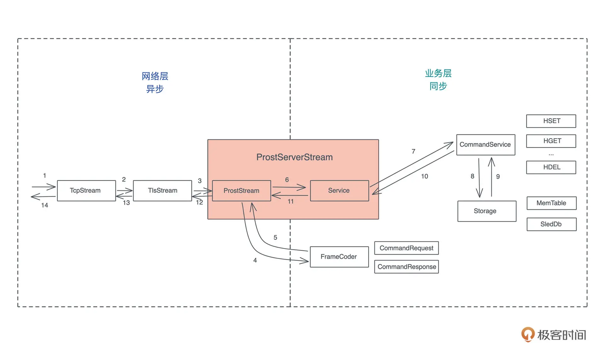

[](https://github.com/tyrchen/simple-kv/actions/workflows/release.yml)

[](https://github.com/tyrchen/simple-kv/actions/workflows/build.yml)

# Simple KV

一个简单的 KV server 实现，配合 geektime 上我的 Rust 第一课。
非常值得学习。看了 2 遍了。
老师说如果你可以自己写出这个simple_kv 的代码，那么你可以在北美找到年包 300k $ 的工作。
## protobuf
命令定义都在`ab.proto`文件中。
通过`build.rs` 文件会自动编译成对应的结构体。 试用的`prost-build`, 因为是编译阶段 用的。所以需要放在`build-dependencies`中。

`ab.proto`文件中定义了`CommandRequest`和`CommandResponse`两个消息。没啥可说的。

`pb/mod.rs` 定义了一些便捷的函数。和一些类型转换。
这课的代码主要是分层设计。
## 错误设计
库的错误一般都是用`thiserror` 来定义的。参考`src/error.rs`文件。

## 存储层
通过`trait` 来定义存储层的接口。
定义在`src/storage/mod.rs`文件中。
有 2 个实现。
- `MemTable` 内存实现。
- `SledDb` sled 实现。

`MemTable` 是`DashMap` 的封装。
`SledDb` 是`sled` 的封装。

`SledDb` 的`get_full_key` 函数，是把`table` 和`key` 拼接成一个字符串。


## 网络层

看到有tcp和quic 2 个实现。
quic 的实现是基于`s2n-quic` 库的。
quic 其实是基于udp的。

选择 QUIC 当：
需要低延迟、抗网络抖动、移动端友好或强制加密（如 HTTP/3）。
​选择 TCP 当：
追求稳定性、高吞吐量或兼容旧设备。

网络层本身也是分层的。
第一层是`stream` 层。
第二层是`tls` 层。
第三层是`multiplex` 层。


## 服务层

这里也是业务代码，应用层。
有多次迭代演变。

### 第一版

第一版只有有个CommandService, 每个command 都实现这个trait。
使用的service 有个ServiceInner 结构体。他有个store 字段，是存储层。
excute方法，最后调用了dispatch方法。

要新增command的话，只需要为他实现CommandService trait 即可。然后再dispatch方法中，添加对应的分支语句即可。 

```rust
pub trait CommandService {
    /// 处理 Command，返回 Response
    fn execute(self, store: &impl Storage) -> CommandResponse;
}
```

### 第二版

只是增加了事件通知。 和sleddb 的实现。
`StorageIter` 演示了下泛型的试用，对行为的抽象。把Item: Into<Kvpair> 的迭代器 转成dyn Iterator<Item = Kvpair>> 的 trait object。
事件通知演示了下链式调用。
也有trait 技巧。把可变事件和不可变事件 统一成一个方法调用，都是`notify` 方法。

### 第三版

去掉了`async-prost`的使用。自己实现了封包和解包。
介绍了下Frame的常用实现
1： 基于\r\n的LineCodec, http/resp 协议的实现。
2： 基于Length的LengthDelimited

可以这么理解。你从tcp stream 中读取的数据，都是字节流。 借助codec，返回给你的字节流就是已经分隔好的数据。
自定义frame, 就需要实现encode和 decode.
encode 就是把 原始的数据 转成编码后的字节流。 这里就是把一个prost 的message 转成字节流。
decode 就是把编码后的字节流 转成 原始的数据。 这里就是把字节流转成一个prost 的message。

最后封装了服务端的ProstServerStream 和 客户端的ProstClientStream。这里注意泛型参数  S: AsyncRead + AsyncWrite + Unpin + Send, 表示S 需要实现AsyncRead, AsyncWrite, Unpin, Send 这4个trait。
 这让后面的功能扩展，可以很方便的替换。

ProstServerStream 进一步隐藏了 Service 的细节。暴露一个process方法。
ProstClientStream 暴露一个execute方法。

### 第四版

这版增加tls的支持。
其实有了上面的 frame的 封包和解包。
这里理解也容易了。就是继续加一层封包和解包。

就是试用tokio-rustls， 提供证书等信息，把普通的stream 包装成tls stream。

得益于之前封装好的ProstClientStream 和 ProstServerStream， 这里只需要在服务端和客户端分别实现tls的握手。
因为S 也实现了AsyncRead + AsyncWrite + Unpin + Send, 所以可以作为参数传递给tls的握手方法。

```rust
impl TlsAcceptor {
    #[inline]
    pub fn accept<IO>(&self, stream: IO) -> Accept<IO>
    where
        IO: AsyncRead + AsyncWrite + Unpin,
    {
        self.accept_with(stream, |_| ())
    }
}
```

当前整体架构参考 


### 第五版

这版小小重构了下，更好地融入rust的生态。
构造一个 ProstStream 结构，让它实现 Stream 和 Sink 这两个 trait，然后让 ProstServerStream 和 ProstClientStream 使用它。
`send`和`recv` 方法可以不用了。直接用stream的next和 send方法。
之前看到 ProstServerStream 和 ProstClientStream 的实现，有重复的 send和recv 方法, 就觉得有点别扭。
这次重构就给去掉了。 

### 第六版

为了支持pub/sub, 引入了 multiplex 的支持。试用了yamux 库。
Yamux 通过在每个数据包前添加头部信息来区分不同的逻辑流。头部包含 Stream ID、帧类型（数据/控制）、长度等元数据。这使得单个 TCP 连接可以承载多个并行传输的独立数据流。
​虚拟连接抽象​
每个 Stream 本质上是一个虚拟连接，通过 net.Conn 接口提供与物理连接相同的读写方法。底层 TCP 的字节流被切割为多个逻辑通道，每个通道有独立的流量控制、状态机管理（如 SYN、FIN 状态）和错误处理机制

为了不影响之前的代码，新增了trait
```rust
pub trait TopicService {
    /// 处理 Command，返回 Response
    fn execute(self, topic: impl Topic) -> StreamingResponse;
}
```
其实和之前的 CommandService 很像。 第二个参数改成了topic, 返回的是一个`pub type StreamingResponse = Pin<Box<dyn Stream<Item = Arc<CommandResponse>> + Send>>;` 类型。 

我们使用了 tokio-stream 的 wrapper 把一个 mpsc::Receiver 转换成 ReceiverStream。这样 Subscribe 的处理就能返回一个 Stream。对于 Unsubscribe 和 Publish，它们都返回单个值，我们使用 stream::once 将其统一起来。


## 使用

生成证书。
```bash
cargo run --bin gen_cert
```

`ps`: 精髓都在老师的第一课里。

## 测试

```bash
cargo test
```

## 基准测试

```bash
cargo bench
```

我的结果
publishing              time:   [4.3689 ms 4.4354 ms 4.5273 ms]

## 性能监控
跑个 all in one 的 jager.

```sh
docker run -d --name jaeger \
  -p 16686:16686 \
  -p 4317:4317 \
  -p 4318:4318 \
  jaegertracing/all-in-one:latest
	```

## ci/cd
就是 github actions 的配置。看`.github/workflows`文件夹。
# 参考

[X.509](https://zh.wikipedia.org/wiki/X.509)
[https://github.com/hashicorp/yamux/blob/master/spec.md](https://github.com/hashicorp/yamux/blob/master/spec.md)